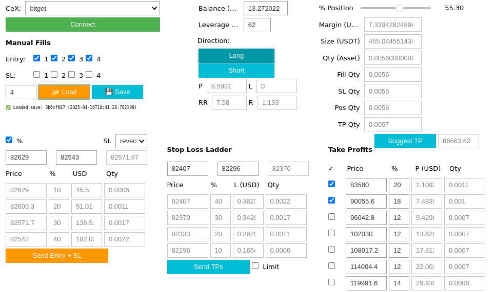
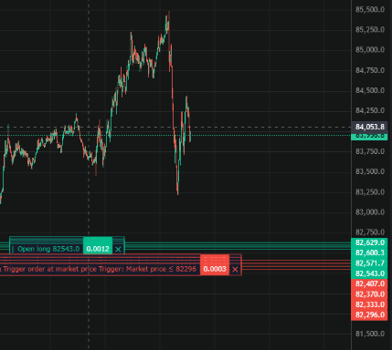

# fin-crypto-orderer

An interactive Jupyter-based tool for managing crypto ladder orders across Binance and Bitget. Supports manual fills, SL/TP planning, and unified backend switching.

---

## ⚠️ Disclaimer

This project interfaces with live crypto exchanges. Use caution — incorrect usage or strategy can result in real financial loss. This software is provided as-is, with no warranties or guarantees. Use at your own risk.

---

## Features

- Interactive ladder builder for entries, SLs, and TPs
- Automatic SL/TP sizing
- Manual fill tracking and session save/load
- Unified API wrapper for Binance (testnet/live) and Bitget (UMCBL live)
- Load/save session states in notebook
- Jupyter widget-based GUI
---

## Setup

1. Clone the repository:
   ```bash
   git clone https://github.com/ma-abdelbar/fin-crypto-orderer.git
   cd fin-crypto-orderer
   ```
---

## 📁 Project Structure

```
fin-crypto-orderer/
│
├── ui.ipynb                # Interactive Jupyter-based GUI
│
├── trader/
│   ├── base.py             # Abstract interface
│   ├── binance.py          # Binance implementation (testnet/live)
│   ├── bitget.py           # Bitget implementation (UMCBL live)
│   ├── unified.py          # Switches between exchanges
│   ├── config.py           # Loads local API credentials
│   └── bitget_sdk/         # Vendor SDK (licensed)
│       └── ...             # Included Bitget REST client
│
├── requirements.txt        # pip install -r
└── README.md
```

---

## 🚀 Quick Start

1. Clone the repository:
```bash
git clone git@github.com:ma-abdelbar/fin-crypto-orderer.git
cd fin-crypto-orderer
```

2. Create and activate a virtual environment:
```bash
python3 -m venv .venv
source .venv/bin/activate
```

3. Install dependencies:
```bash
pip install -r requirements.txt
```

4. Set up your API keys:
Create a file called `trader/.env`:
```env
BINANCE_API_KEY=your_key
BINANCE_API_SECRET=your_secret
BITGET_API_KEY=your_key
BITGET_API_SECRET=your_secret
BITGET_PASSPHRASE=your_pass
```

5. Launch Jupyter and open the app:
```bash
jupyter lab
```
Open `ui.ipynb` and start planning your orders.

---

## Exchange Support

| Exchange | Testnet | Live | SL/TP Type |
|----------|---------|------|------------|
| Binance  | ✅       | ✅    | Limit + Trigger |
| Bitget   | ❌       | ✅    | Limit + Plan |

---

## UI & Order Preview

The app provides an interactive GUI for order planning and submits entries, SLs, and TPs directly to the exchange. Below are examples of the Jupyter interface and how orders appear on the trading chart.

**Jupyter-based GUI:**



**Order appearance on exchange chart (Bitget shown):**



---

## 🙏 Credits

Bitget SDK © [bitget-exchange-open-api-sdk](https://github.com/bitget-exchange/bitget-api-sdk-python)  
Modified and embedded under `trader/bitget_sdk/` for simplified import and usage.

---

## Development Notes

Future updates may include:
- Support for additional exchanges beyond Binance and Bitget
- Improvements to the "Suggest TP" algorithm and UI behavior

---

## License
MIT License. See LICENSE for full text.

Bitget SDK © bitget-exchange-open-api-sdk